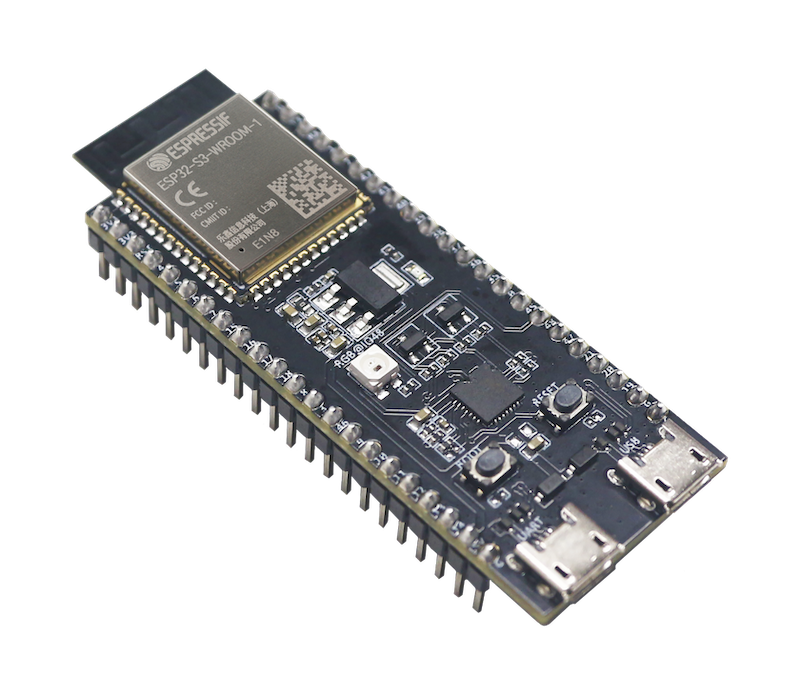
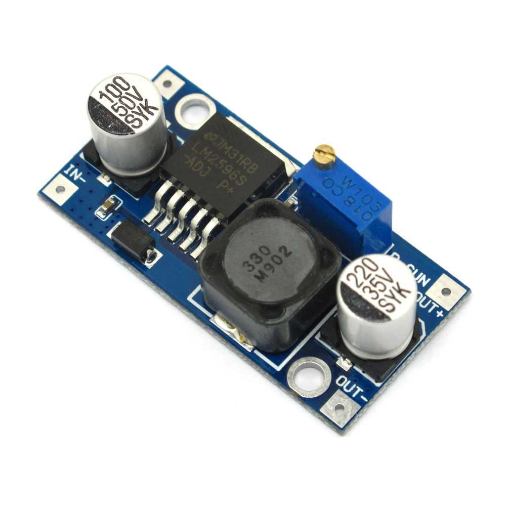
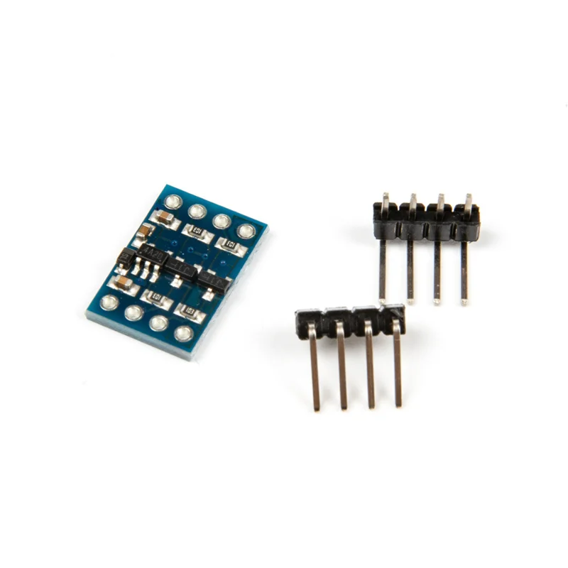
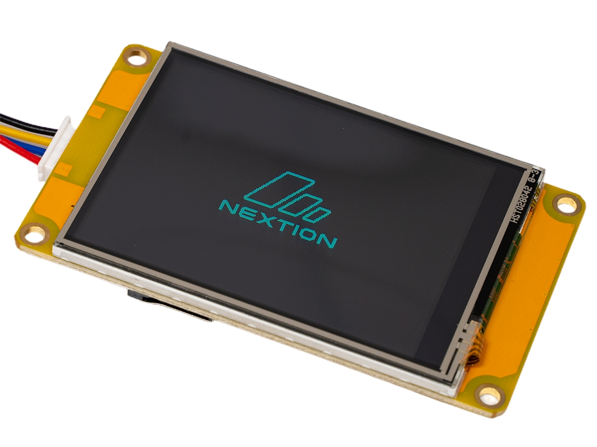
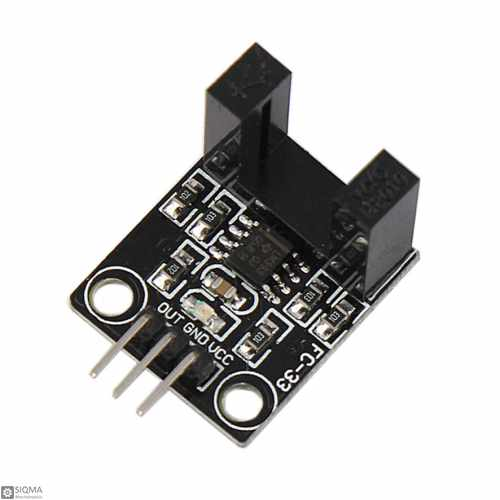
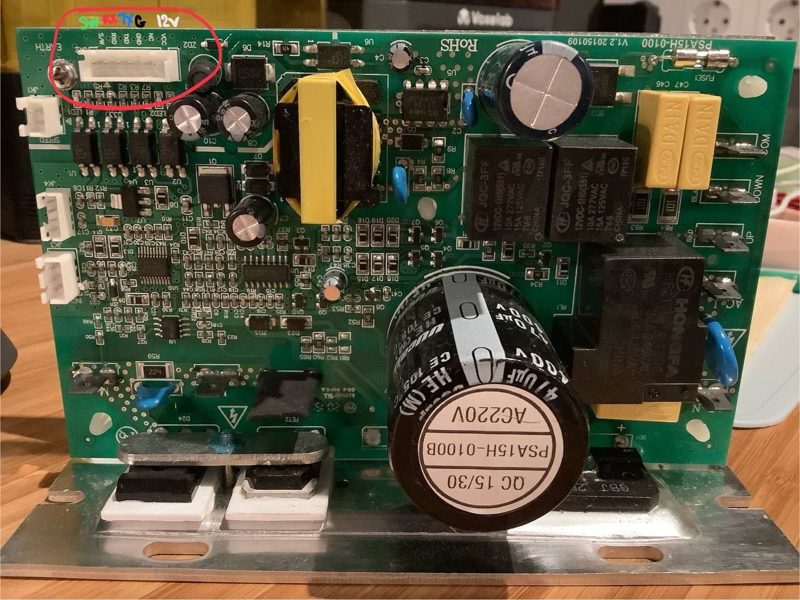
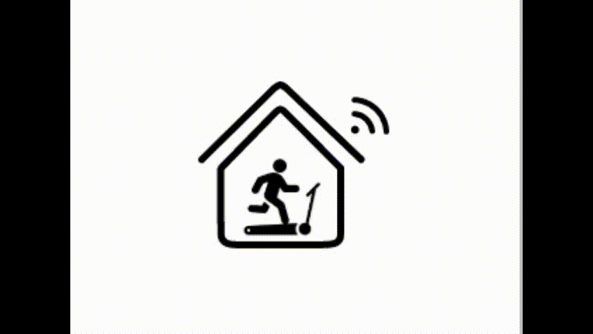
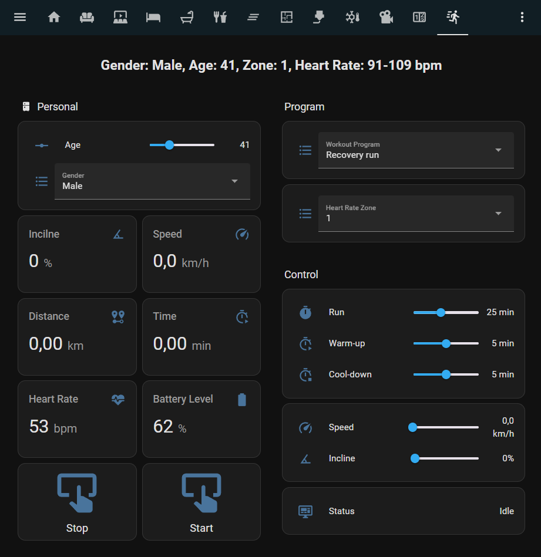

# Transform Your Treadmill with FTMS on ESPHome via ESP32-S3 BLE with Nextion Display

### Supported FTMS Apps
- :white_check_mark: Zwift
- :white_check_mark: Kinomap (Android/iOS)
- :white_check_mark: FitShow
- :white_check_mark: Kinni
- :white_check_mark: qdomyos

**[Русская версия / Russian version](docs/readme/README.ru.md)**

## About the Project
Transform your old treadmill into a smart training companion! Using ESP32-S3 and ESPHome firmware, you can add FTMS support for fitness apps via BLE, plus smart heart rate-based programs and built-in training modes. Designed for treadmills with PSA(xx) boards, it adapts to any UART-enabled treadmill. Minimal cost, maximum potential!

## How It Works
The project uses the ESP32-S3 to communicate with the treadmill’s board (e.g., PSA(xx)) via UART. Commands like `[SETSPD:010]` (1 km/h) or `[SETINC:000]` (0%) were reverse-engineered by analyzing traffic with a UART logger. The microcontroller processes this data, converts it into real speed and incline values, and transmits them via Bluetooth Low Energy (BLE) to apps like Zwift or logs them locally for analysis in Grafana.

A heart rate monitor connects via BLE to provide pulse data. Real-time intelligent algorithms analyze the heart rate and smoothly adjust the treadmill’s settings to maintain your target training zone. For example, if your pulse drifts outside the goal, the speed adjusts automatically for a personalized and effective workout.

### Advantages
- **Flexibility**: Compatible with any UART-supporting treadmill.
- **Modernity**: Powered by the robust ESP32-S3 microcontroller.
- **Affordability**: Requires minimal hardware components.

## Recommended Hardware
  <details>
  <summary><b>ESP32-S3</b>: Highly recommended for performance and BLE support. (Click to detail)</summary>
  
  </details>
  
  <details>
  <summary><b>LM2596S</b>: Voltage converter from 12V to 5V (non-isolated). (Click to detail)</summary>
  
  </details>
  
  <details>
  <summary><b>2-channel level shifter</b>: To match 5V (PSA(xx)) and 3.3V (ESP32 S3). (Click to detail)</summary>
  
  </details>
    
  <details>
  <summary><b>Nextion display</b>: For enhanced user interface and interaction. (Click to detail)</summary>
  
  </details>
  
  <details>
  <summary><b>FC33</b>: Optical speed sensor for treadmill calibration optional. (Click to detail)</summary>
  
  </details>
  
  <details>
  <summary><b>Treadmill</b>: Ideally with a PSA(xx) board, but any UART-capable model (RX-TX) will do. (Click to detail)</summary>
  
  </details>

## Connection
<details>
<summary>▶️ Click to Connection detail</summary>

- ESP32-S3:
  - GPIO17 (TX): Transmits data to RX (Pin 5) on PSA(xx) through a level shifter.
  - GPIO18 (RX): Receives data from TX (Pin 4) on PSA(xx) through a level shifter.
  - GND: Common ground with the level shifter (3.3V side).
  - 3.3V: Power supply for the Low Voltage (LV) side of the level shifter.
- ESP32-S3 (Power Supply Connections):
  - LV (Low Voltage): 3.3V side connected to the ESP32.
  - HV (High Voltage): 5V side connected to PSA(xx).
  - GND (LV): Ground from the ESP32.
  - Vcc (LV): 3.3V from the ESP32.
  - GND (HV): Ground from the LM2596S.
  - Vcc (HV): 5V from the LM2596S.
- PSA(xx) Board (6-pin):
  - Pin 1 (12V): Supplies power to the board, feeds the input of the LM2596S, and connects to Pin 6 (SW).
  - Pin 2: Not connected (unused).
  - Pin 3 (GND): Common ground with the LM2596S and the level shifter.
  - Pin 4 (TX): Transmits data to GPIO18 (RX) on the ESP32 through the level shifter.
  - Pin 5 (RX): Receives data from GPIO17 (TX) on the ESP32 through the level shifter.
  - Pin 6 (SW): Connected to Pin 1 (12V) to power on the treadmill.
- PSA(xx) Board (Additional 6-pin Section):
  - Input 12V: Receives power from Pin 1 (12V) of PSA(xx).
  - Output 5V: Provides power to the Vcc (HV) side of the level shifter.
  - GND: Common ground with PSA(xx) and the level shifter.
- Nextion Display:
  - TX: Transmits data to RX (GPIO43) on ESP32-S3
  - RX: Receives data from TX (GPIO44) on ESP32-S3
  - GND: Ground from the LM2596S.
  - Vcc: 5V from the LM2596S.

</details>
 
## Features
### Core Functions
- **Zwift Support**: Full integration with the popular platform.

  <details>
  <summary>▶️ Click to expand Zwift example</summary>
  
  </details>

- **FTMS Support**: Compatibility with Kinomap, FitShow, and Kinni.
- **Heart Rate Monitor**: Connects via BLE with zone calculation based on age and gender.
- **Real Data**: Accurate incline percentages and speed calibration.
- **Button Control**: Adjust speed and incline via GPIO with feedback.
- **Manual Mode**: Train without a heart rate monitor.
- **Local Storage**: Save runs and visualize them in Grafana.
- **Nextion Display**: Supports touch display for easy workout monitoring and treadmill control.
  <details>
  <summary>▶️ Click to expand nextion display example</summary>
  
  </details>

### Smart Adjustment
- **Pulse Maintenance**: Speed adjusts smoothly based on the difference from the target zone:
  - Difference > 20 bpm: ±0.5 km/h in 0.1 steps every 2 seconds.
  - Difference < 20 bpm: ±0.1 km/h every 20 seconds.

### Warm-Up
- **Smart Warm-Up**: Brings pulse to Zone 1 to prepare ligaments.
- **Customizable Time**: Waits for Zone 1, then completes based on a timer (e.g., 5 minutes).

### Cool-Down
- **Smooth Reduction**: Lowers speed until pulse returns to Zone 1.
- **Customizable Time**: Mirrors the warm-up logic.

### Heart Rate-Based Training Programs
- **Custom Zone**: Maintains a set pulse zone via speed adjustments.
- **Fat Burning**: Zone 2 with smooth speed and incline control.
- **HIIT**: Switches between Zones 1 and 4 based on heart rate with auto-speed tuning.
- **Recovery run**: Keeps Zone 1 for light running.

### Hassio Interface
    <details>
    <summary>▶️ Click to image Hassio Interface</summary>
    
    </details>

## ESPHome Setup
The file (config.yaml) configures the ESP32 S3 to control the treadmill and connect the heart rate monitor.
- UART configuration for communicating with the treadmill (used to send and receive commands)
```yaml
uart:
  tx_pin: GPIO17    # Transmit data (TX) on GPIO17
  rx_pin: GPIO18    # Receive data (RX) on GPIO18

# Bluetooth Low Energy (BLE) configuration for connecting the heart rate monitor
ble_client:
  - mac_address: "XX:XX:XX:XX:XX:XX"  # Replace with your heart rate monitor's MAC address
```

## Future Plans
- :white_check_mark:Expanding FTMS support for Kinomap compatibility on iOS.
- Add "Fitness Test" Program
- Add interactive elevation maps and new training programs.
- :white_check_mark:Develop a display with a user-friendly interface.
- Enable auto-incline support in Zwift.
- Design an all-in-one board for easier assembly.
- Create an ESPHome component for seamless ecosystem integration.
- Integrate a distance sensor (TOF400C-VL53L1X) for button-free speed control.
- Implement MQTT data transmission for broader integration.
- Build a web interface for control without Home Assistant.

## Changelog
- May 17, 2025:
  - Added Nextion display integration in YAML configuration.
  - Added Nextion display project design created in Lunacy software.
  - Added Nextion display project (HMI file) for Nextion Editor to the display.
- April 12, 2025:
  - Added full FTMS support for Kinomap on iOS using shortened UUIDs.
  - Added support for FTMS statuses (Training Status / Fitness Machine Status).
- April 9, 2025: Initial FTMS support added for Kinomap (Android), FitShow, and Kinni.

## Authors
Created by [@samsonovss](https://t.me/samsonovss) & xAI Assistant

## Support the Project
Your support helps keep this project alive and growing! If you'd like to contribute, you can make a donation using one of the following methods:
- **PayPal**: samsonov@hotmail.com
- **Bitcoin (BTC)**: `bc1q3cza0kasutzes4hfddxuclmd9ghn5v7zw2nr5c`  
- **USDT (TRC-20)**: `0x5dd5a346Dd64dfE938a60D7b24b633b1ACE01719`
  
Every bit helps — thank you!
