# Smart ESPHome Treadmill with FTMS and Zwift

[Русская версия](README.ru.md) | [Changelog](CHANGELOG.md) | [Telegram community](https://t.me/TreadmillSmart)

A complete ESP32-S3 and ESPHome replacement for a treadmill's original console. The project controls the treadmill motor board over UART, exposes workout data and controls through Bluetooth FTMS, and integrates with Home Assistant, a Nextion display, heart-rate training programs, safety sensors, and automatic incline control.

> [!WARNING]
> This project directly controls the treadmill motor and incline mechanism. Before the first run, verify emergency stop behavior, speed and incline limits, UART commands, and thermal protection. Do not test a new configuration while standing on a moving belt.

<p align="center">
  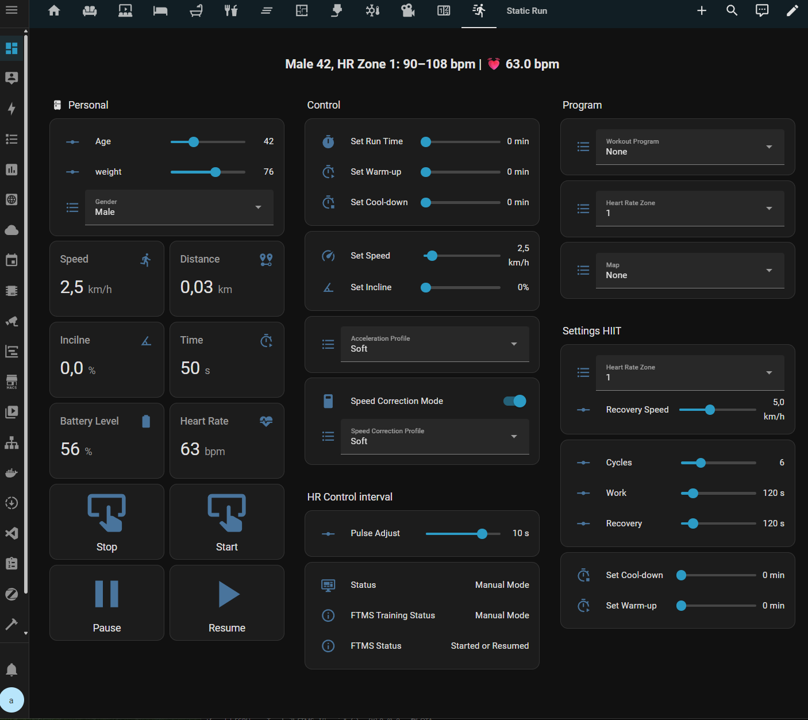
</p>

## Features

- direct Bluetooth FTMS connection to Zwift and other fitness applications;
- native Zwift route-grade reception and physical treadmill incline control;
- calibration between real Zwift grade and treadmill-specific incline levels;
- standalone elevation profiles for real-world and Zwift routes;
- speed and incline control through Home Assistant and Nextion;
- manual, heart-rate, warm-up, cool-down, and HIIT workout modes;
- BLE heart-rate monitor with heart-rate zone calculation;
- adaptive speed correction using an FC-33 optical sensor;
- distance-based Free Run and safe-zone control using VL53L1X;
- motor temperature monitoring and restart lockout after overheating;
- workout statistics including duration, distance, calories, pace, MET, VO2, fat, and HR zones;
- printable enclosure and sensor mounts.

## Architecture

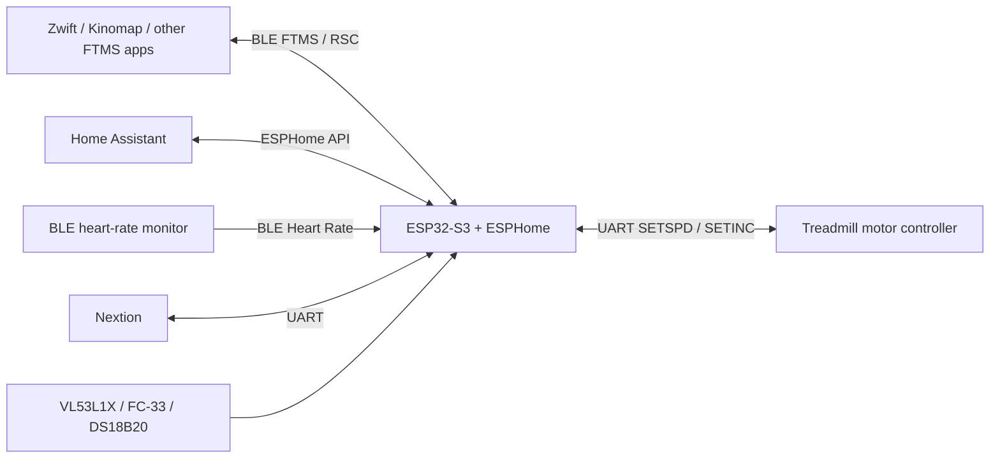
```mermaid
flowchart LR
    Apps[Zwift / Kinomap / other FTMS apps]
    HA[Home Assistant]
    HR[BLE heart-rate monitor]
    ESP[ESP32-S3 + ESPHome]
    Display[Nextion]
    Sensors[VL53L1X / FC-33 / DS18B20]
    Board[Treadmill motor controller]

    Apps <-->|BLE FTMS / RSC| ESP
    HA <-->|ESPHome API| ESP
    HR -->|BLE Heart Rate| ESP
    Display <-->|UART| ESP
    Sensors --> ESP
    ESP <-->|UART SETSPD / SETINC| Board
```

The ESP32-S3 acts as the central controller. It receives commands from the UI, workout programs, or fitness apps, sends them to the treadmill motor controller, and publishes telemetry back to Home Assistant and BLE clients.

## Supported Applications

Tested applications:

- Zwift;
- Kinomap on Android and iOS;
- FitShow;
- Kinni;
- Qdomyos-Zwift.

Other FTMS applications may behave differently. FTMS support alone does not guarantee that every application uses the same characteristics and control commands.

## Zwift Automatic Incline

The project supports two independent incline modes:

1. **Native Zwift incline**: the current route grade is received directly from Zwift and mapped to the treadmill's physical incline level.
2. **Standalone route profiles**: saved elevation profiles can run without the Zwift application.

Native mode provides:

- `Zwift Auto Incline` to enable physical incline control;
- `Treadmill Maximum Incline Level` for the treadmill controller limit;
- `Treadmill Real Grade At Maximum` for the measured real grade at that level;
- `Zwift Incline Intensity` for a 0-100% effect strength;
- `Zwift Requested Incline` for the grade received from Zwift;
- `Zwift Mapped Treadmill Incline` for the resulting treadmill target.

A treadmill value of `15` does not necessarily mean a real `15%` grade. Measure the actual belt rise and calibrate the mapping before enabling automatic incline.

See [Zwift setup and incline calibration](docs/guides/ZWIFT.md).

<details>
  <summary><b>Zwift demonstration</b></summary>
  <p align="center">
    
  </p>
</details>

## Treadmill Compatibility

The current configuration was developed for a treadmill with a PSA(xx)-family motor board accepting commands such as:

```text
[SETSPD:010]  -> 1.0 km/h
[SETINC:050]  -> incline level 5.0
```

Another treadmill can be adapted when its control interface is accessible, but the presence of UART does not make it automatically compatible. Voltage levels, baud rate, packet format, commands, feedback, and safe limits must be identified first.

See the [UART parsing guide](docs/guides/UART_PARSING.md).

## Hardware

Core components:

- ESP32-S3 with PSRAM and 16 MB Flash;
- treadmill with access to the lower motor controller interface;
- bidirectional logic-level converter;
- step-down power converter;
- Nextion `NX4880E043-011C`, 4.3-inch, 800 x 480 display;
- BLE heart-rate monitor.

Optional components:

- VL53L1X/TOF400C for Free Run, safe-zone detection, and display control;
- FC-33 for real-speed measurement and correction;
- DS18B20 for motor temperature monitoring;
- 3D-printed enclosure and mounts.

<details>
  <summary><b>Component photos</b></summary>
  <p align="center">
    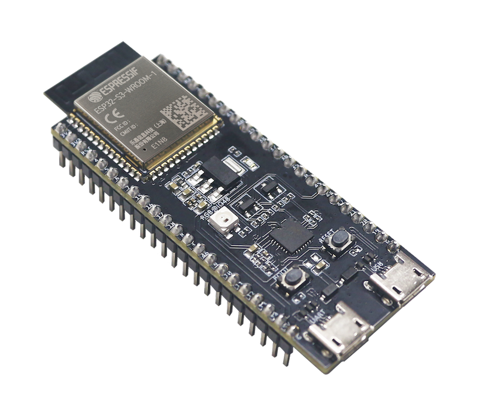
    
    
  </p>
  <p align="center">
    
    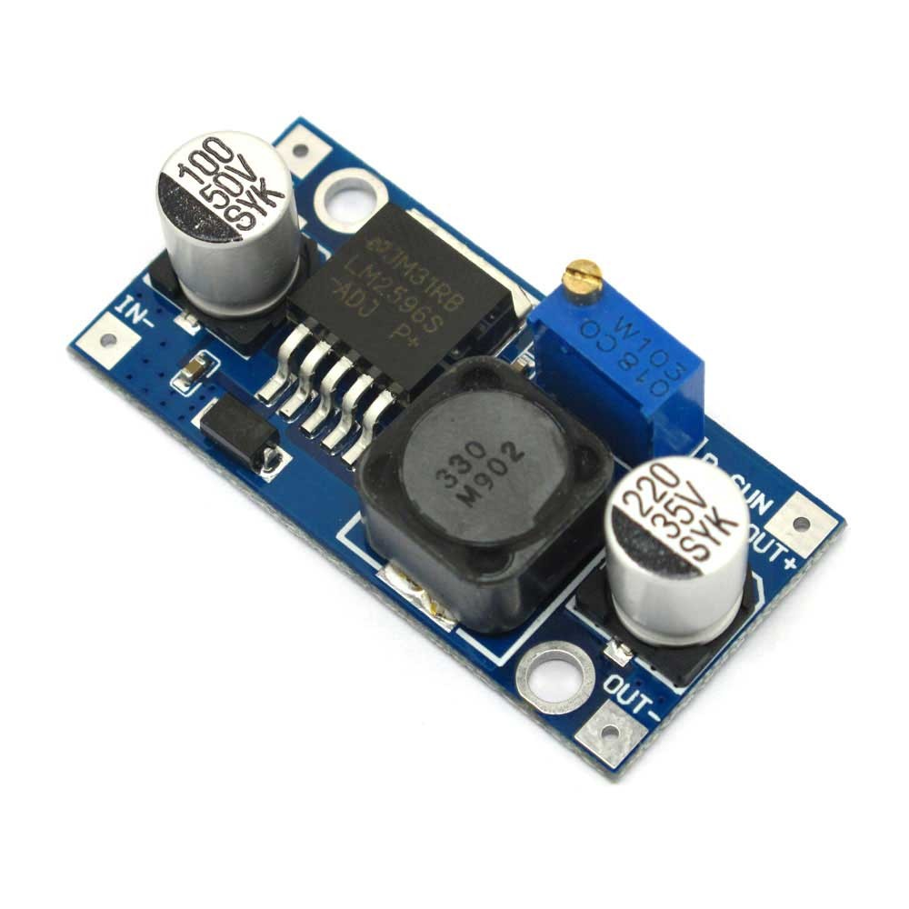
    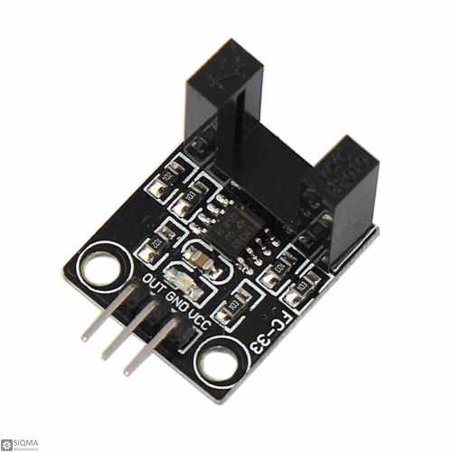
  </p>
</details>

## Wiring

<p align="center">
  
</p>

Pins used by the current configuration:

| Function | ESP32-S3 |
|---|---|
| Nextion RX/TX | GPIO1 / GPIO2 |
| Treadmill board TX/RX | GPIO17 / GPIO18 |
| I2C SDA/SCL | GPIO12 / GPIO11 |

Verify the voltage levels of your motor board before connecting it. Never feed 5 V or 12 V directly into ESP32-S3 GPIO pins.

## Quick Start

1. Download the repository and copy the contents of `esphome/` into your ESPHome configuration directory.
2. Rename `secrets.example.yaml` to `secrets.yaml`.
3. Configure Wi-Fi, API, OTA, fallback access point, DS18B20 address, heart-rate monitor MAC, and Nextion TFT URL.
4. Verify pin assignments, UART settings, and the command format used by your treadmill.
5. Disconnect the power stage and first test ESP32 boot, Nextion, and sensors.
6. Create a backup, compile the configuration, and inspect the logs.
7. Test stop behavior, minimum speed, and incline reset without a person on the belt.

The configuration is a working example for one installation, not a universal firmware image for every treadmill.

## Workout Modes

- manual control;
- Pulse Zone;
- Fat Burn;
- Recovery Run;
- configurable HIIT work and recovery cycles;
- warm-up and cool-down;
- distance-based Free Run;
- precomputed route elevation profiles;
- native Zwift incline control.

Speed correction profiles include `Soft`, `Precise`, and `Aggressive`. Acceleration profiles include `Soft`, `Normal`, `Fast`, and `Technogym`.

## Interfaces

The local ESPHome web interface is available on port `80` without authentication. It does not provide Web OTA. Keep it inside a trusted LAN and do not expose it to the internet.

<details>
  <summary><b>Home Assistant</b></summary>
  <p align="center">
    
  </p>
</details>

<details>
  <summary><b>Nextion</b></summary>
  <p align="center">
    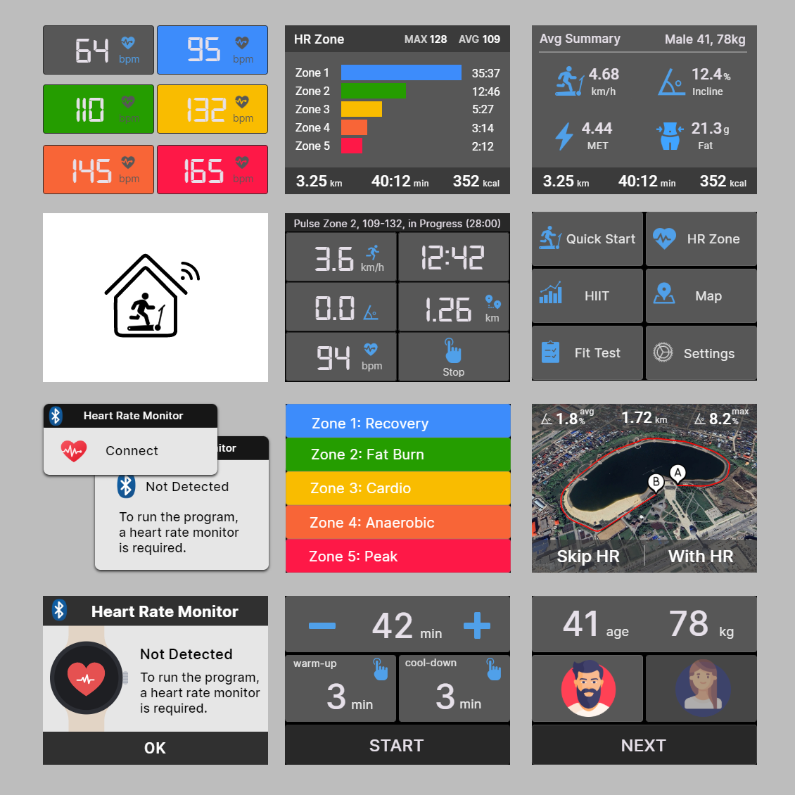
  </p>
</details>

<details>
  <summary><b>Finished treadmill gallery</b></summary>
  <p align="center">
    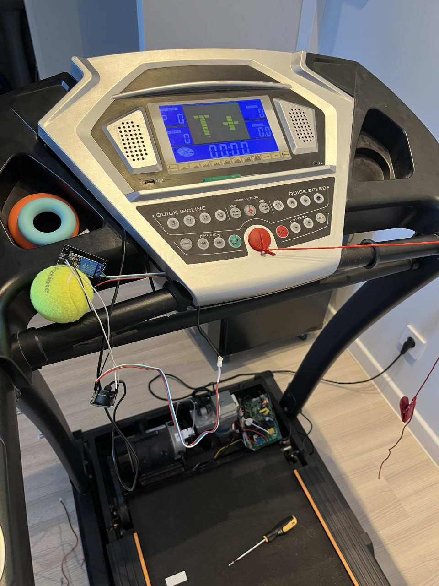
    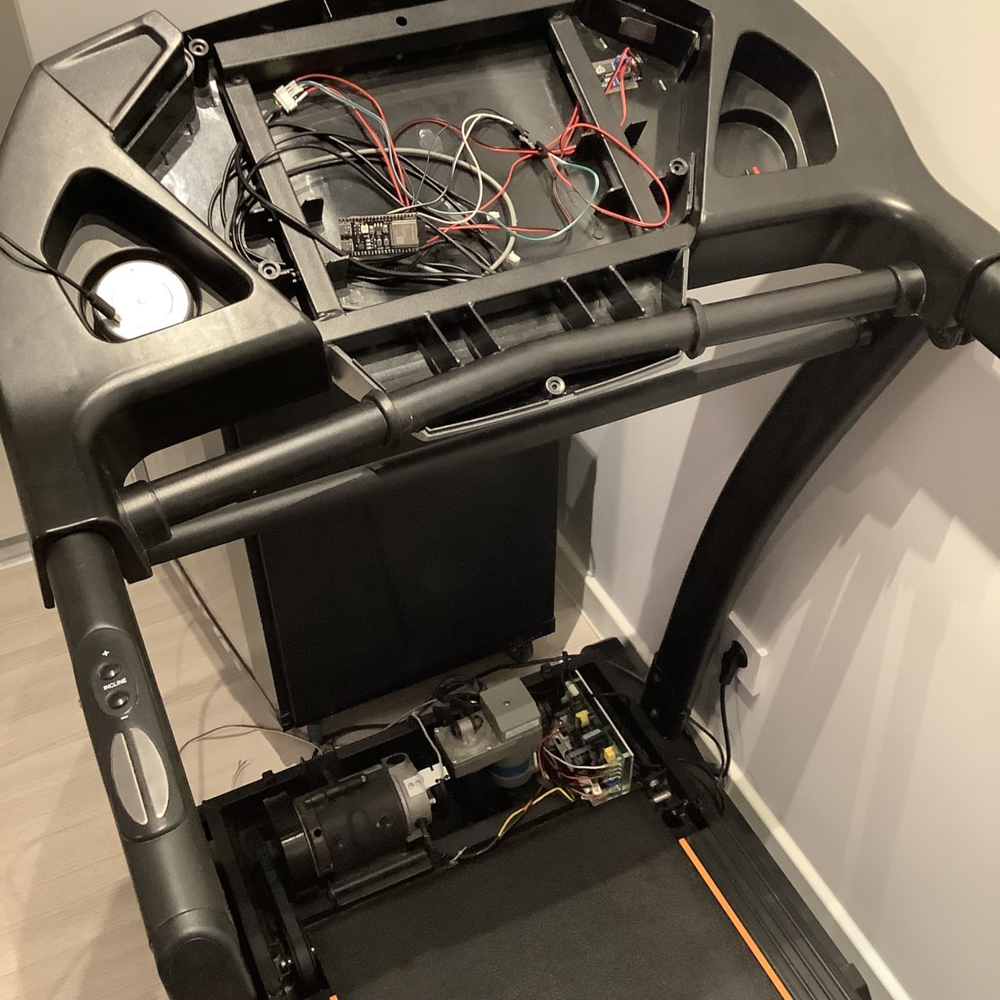
    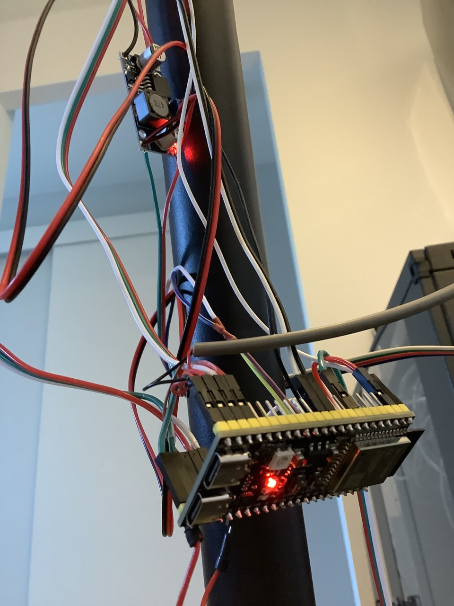
  </p>
  <p align="center">
    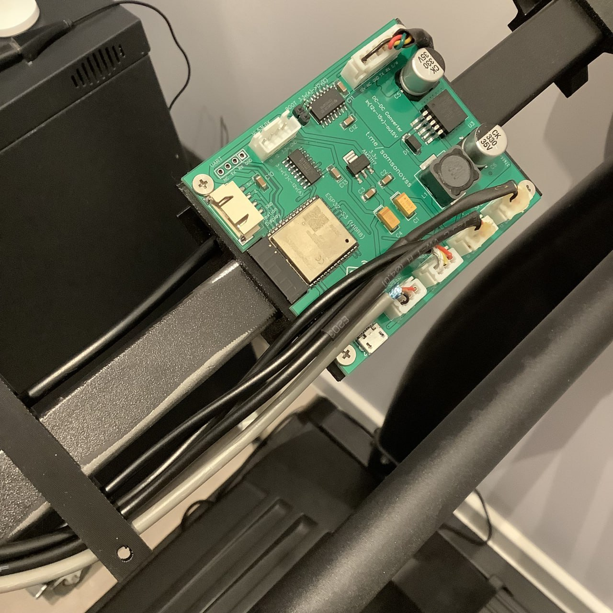
    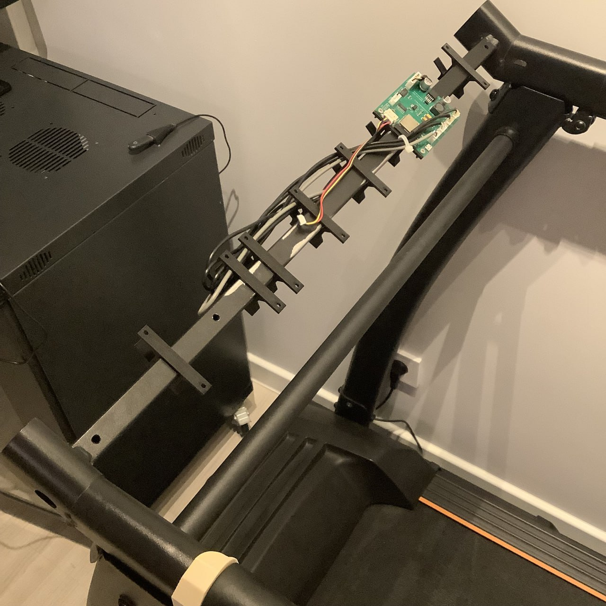
    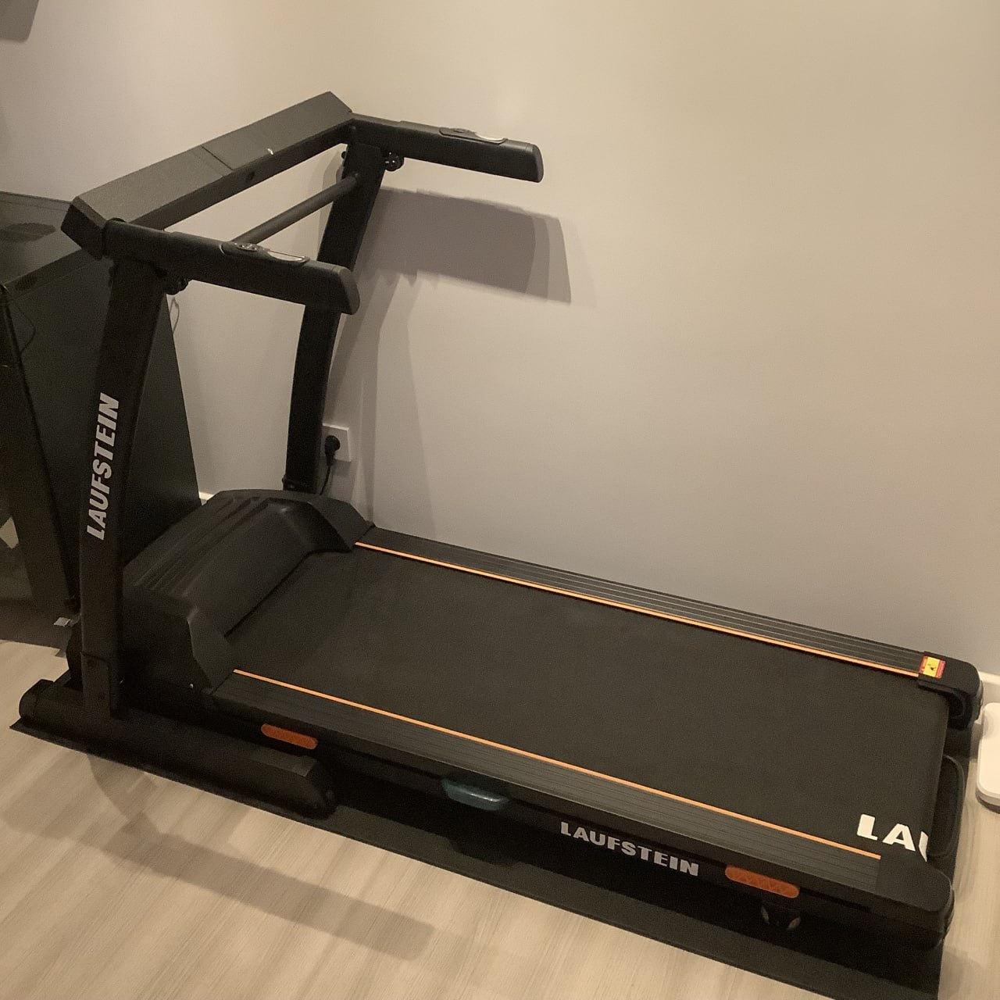
  </p>
</details>

Videos:

- [control dashboard overview](https://youtube.com/shorts/wjRsA46usog);
- [treadmill running demonstration](https://youtube.com/shorts/QqvJLKn4GOk).

## Repository Layout

- [`esphome/`](esphome/) - ESPHome configuration and incline profiles;
- [`nextion_display/`](nextion_display/) - display source, HMI, and compiled TFT;
- [`incline_data/`](incline_data/) - GPX data, route profiles, and conversion scripts;
- [`3d-models/`](3d-models/) - printable enclosure and sensor mounts;
- [`PCB/`](PCB/) - future PCB design materials;
- [`docs/guides/`](docs/guides/) - detailed setup guides;
- [`docs/specs/FTMS_v1.0.pdf`](docs/specs/FTMS_v1.0.pdf) - FTMS specification;
- [`CHANGELOG.md`](CHANGELOG.md) - project history.

## Roadmap

- universal custom PCB;
- dedicated ESPHome component;
- web interface without Home Assistant;
- MQTT integration;
- additional routes and workout programs;
- cadence measurement.

Completed work is removed from the roadmap and recorded in the [changelog](CHANGELOG.md).

## Author and Community

Created by [Anton Samsonov](https://t.me/samsonovss).

Discussion, builds, and support: [Treadmill Smart](https://t.me/TreadmillSmart).

## Support the Project

- PayPal: `samsonov@hotmail.com`
- BTC: `bc1q3cza0kasutzes4hfddxuclmd9ghn5v7zw2nr5c`
