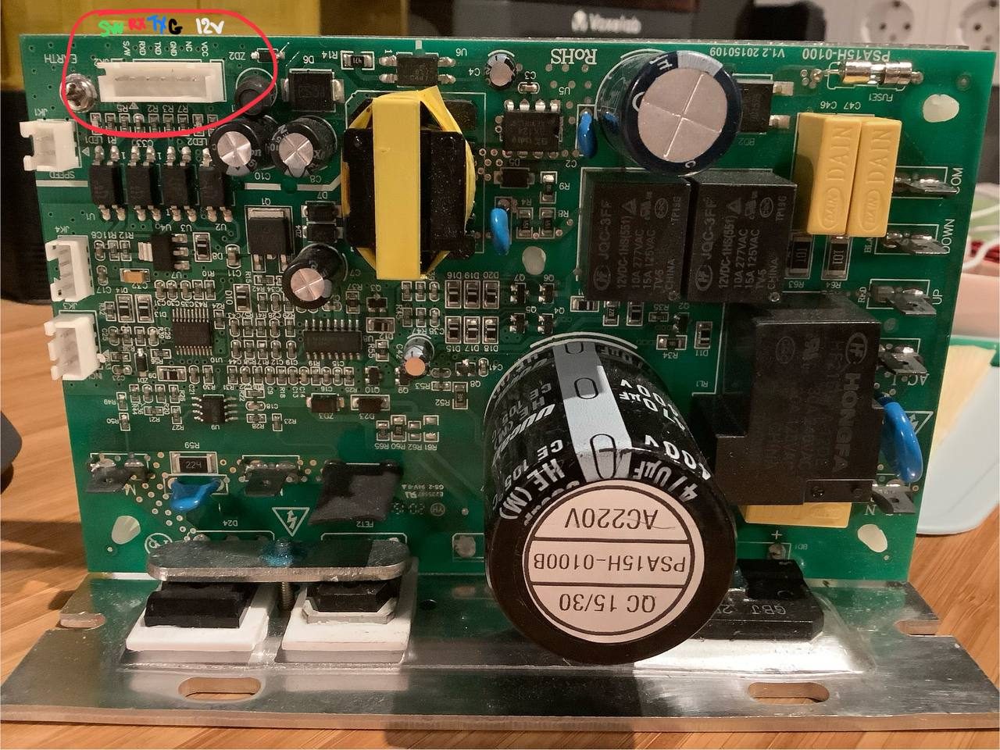

# Full Treadmill Computer Implementation on ESPHome

Transform your old treadmill into a modern, smart training companion! This project is a complete replacement for the treadmill's onboard computer, built on ESP32-S3 and ESPHome firmware. It integrates the [Fitness Machine Service (FTMS)](/docs/specs/FTMS_v1.0.pdf) protocol for direct communication with fitness apps via Bluetooth, eliminating the need for bridges or third-party apps. It also includes smart heart rate-based programs and built-in training modes. Designed for treadmills with PSA(xx) boards, it adapts to any UART-enabled model. Minimal cost, maximum potential!

<details>
  <summary>Hassio Treadmill Interface</summary>
  <p align="center">
  
</details>

<details>
  <summary>Show Gallery</summary>
  <p align="center">
    
    
    
  </p>

  <p align="center">
    
    
    
  </p>

  <p align="center">
    
    
    
  </p>
</details>

<details>
  <summary>Show Video</summary>
  <p align="center">
    🎥 <a href="https://youtube.com/shorts/wjRsA46usog">Watch on YouTube</a>
  </p>

  <p align="center">
    📁 <a href="/docs/images/treadmill/IMG_6088.MOV">Download RAW video</a>
  </p>
</details>

### Supported FTMS Apps
- :white_check_mark: Zwift
- :white_check_mark: Kinomap (Android/iOS)
- :white_check_mark: FitShow
- :white_check_mark: Kinni
- :white_check_mark: qdomyos

**[Русская версия / Russian version](README.ru.md)**  
**[Changelog / История изменений](CHANGELOG.md)**

## Table of Contents
- [About the Project](#About-the-Project)
- [How It Works](#how-it-works)
- [UART Parsing](docs/guides/UART_PARSING.md)
- [Recommended Hardware](#recommended-hardware)
- [Connection](#connection)
- [Features](#features)
- [ESPHome Setup](#esphome-setup)
- [Workout Results Example](#workout-results-example)
- [Future Plans](#future-plans)
- [Changelog](CHANGELOG.md)

## About the Project
- **Goal**: Replace the outdated treadmill onboard computer with a modern solution.
- **Key Features**:
  - Full implementation of the treadmill computer using ESP32-S3 and ESPHome firmware.
  - Integration of the [Fitness Machine Service (FTMS)](/docs/specs/FTMS_v1.0.pdf) protocol for direct connection to fitness apps (Zwift, Kinomap, etc.) via Bluetooth Low Energy (BLE) without intermediaries.
  - Minimalist design with a compact Nextion display showing speed, time, and distance, unobstructed by a tablet or monitor.
  - UART support for communication with the treadmill board, e.g., PSA(xx).
  - Smart algorithms for adjusting speed and incline based on heart rate data.

## How It Works
The project uses the ESP32-S3 to communicate with the treadmill’s board (e.g., PSA(xx)) via UART. Commands like `[SETSPD:010]` (1 km/h) or `[SETINC:000]` (0%) were reverse-engineered by analyzing traffic with a [UART parsing](docs/guides/UART_PARSING.md). The microcontroller processes this data, converts it into real speed and incline values, and transmits them via Bluetooth Low Energy (BLE) to apps like Zwift or logs them locally for analysis in Grafana.

A heart rate monitor connects via BLE to provide pulse data. Real-time intelligent algorithms analyze the heart rate and smoothly adjust the treadmill’s settings to maintain your target training zone. For example, if your pulse drifts outside the goal, the speed adjusts automatically for a personalized and effective workout.

## Key Insight: Why I Removed the Original Onboard Computer
- **Issues with the Original Onboard Computer**:
  1. **Command Conflict**: When sending commands from the upper onboard computer directly to the lower board, they transmit successfully, but the upper board continues sending its own data, interfering with my commands.
     - Solution: Send commands via UART to the upper board to set speed and incline, letting it relay them to the lower board. However, I couldn’t successfully send data to the upper board. Instead, commands are sent directly to the lower board with ease.
  2. **Outdated Design**: The original onboard computer is bulky and takes up significant space. While convenient for placing a tablet, it blocks the display showing speed, incline, and distance.
- **My Solution**:
  - Completely removed the upper onboard computer.
  - Developed a minimalist panel with a compact Nextion display, ensuring speed, time, and distance are always visible, with space above for a tablet or monitor without obstructing key metrics.

## UART Data Reading and Parsing
To integrate with the treadmill, you need to connect to UART and decode data (e.g., speed `[SETSPD:010]`, incline `[SETINC:000]`). A detailed guide on connecting, reading raw data, and decoding it is available in [UART_PARSING.md](docs/guides/UART_PARSING.md).

## Advantages
- **Flexibility**: Compatible with any UART-supporting treadmill.
- **Modernity**: Complete replacement of the onboard computer using ESP32-S3.
- **Direct Connection**: FTMS via BLE without bridges or third-party apps.
- **Affordability**: Minimal hardware costs.

## Recommended Hardware

  <details>
  <summary><b>Nextion EDGE SERIES IPS Display NX4880E043-011C 4.3" 800x400</b> (▶️ Click for details)</summary>
  

  **Description**: The Nextion NX4827P043-011C delivers vibrant, clear visuals with its IPS panel. The capacitive touch ensures reliable control, and its dedicated processor reduces the ESP32 load. Interface customization via Nextion Editor is intuitive, enabling easy creation of custom screens for data display and treadmill control.
  </details>

  <details>
  <summary><b>ESP32-S3</b>: Highly recommended for performance and BLE support. (▶️ Click to detail)</summary>
  
  </details>
  
  <details>
  <summary><b>ToF400C (VL53L1X)</b>: Time‑of‑Flight distance sensor, up to 4 m range. (▶️ Click to detail)</summary>
  
  </details>

  <details>
  <summary><b>LM2596S</b>: Voltage converter from 12V to 5V (non-isolated). (▶️ Click to detail)</summary>
  
  </details>
  
  <details>
  <summary><b>2-channel level shifter</b>: To match 12V (PSA(xx)) and 3.3V (ESP32 S3). (▶️ Click to detail)</summary>
  
  </details>

  
  <details>
  <summary><b>FC33</b>: Optical speed sensor for treadmill calibration optional. (▶️ Click to detail)</summary>
  
  </details>
  
  <details>
  <summary><b>Treadmill</b>: Ideally with a PSA(xx) board, but any UART-capable model (RX-TX) will do. (▶️ Click to detail)</summary>
  
  </details>

  ## Connection
  <details>
  <summary>▶️ Click for connection details</summary>
  
  </details>
 
## Features
### Core Functions
- <details>
  <summary><b>Zwift Support</b>: Full integration with the popular platform. (▶️ Click to detail)</summary>
  
  </details>
- **FTMS Support**: Compatibility with Kinomap, FitShow, and Kinni.
- **Heart Rate Monitor**: Connects via BLE with zone calculation based on age and gender.
- **Real Data**: Accurate incline percentages and speed calibration.
- **Button Control**: Adjust speed and incline via GPIO with feedback.
- **Manual Mode**: Train without a heart rate monitor.
- **Local Storage**: Save runs and visualize them in Grafana.
- **Interface**:
  <details>
  <summary><b>Nextion Display</b>: Supports touch display for easy workout monitoring and treadmill control. (▶️ Click to detail)</summary>
  
  </details>
  <details>
  <summary><b>Hassio Interface</b> (▶️ Click to detail)</summary>
  
  </details>

## Workout Results Example
- After completing a workout, results are logged in the "Workout Summary" format. Example:
```yaml
  ===== Workout Summary =====
  User: Gender=Male, Age=41 years, Weight=75.0 kg, Max HR=181 bpm
  Duration: 33.87 min (2032 sec)
  Distance: 3.42 km
  Calories: 178 kcal
  Fat Burned: 9.6 g
  Avg Speed: 6.06 km/h
  Avg Incline: 1.85% (Real Incline: 0.62%)
  Avg MET: 4.21
  Avg VO2: 14.7 ml/kg/min
  Avg Heart Rate: 121 bpm
  Max Heart Rate: 138 bpm
  Heart Rate Zones: Zone1=1:57, Zone2=12:23, Zone3=17:12, Zone4=0:00, Zone5=0:00
  ===== End of Summary =====
```

### Smart Adjustment
- **Pulse Maintenance**: Speed adjusts smoothly based on the difference from the target zone:
  - Difference > 10 bpm: ±0.5 km/h in 0.1 steps every 2 seconds.
  - Difference < 10 bpm: ±0.1 km/h every 20 seconds.

### Warm-Up
- **Gradual Start**: Gradual Start: Speed increases by 0.1 km/h every 10 seconds during the warm-up period. If the heart rate doesn't reach Zone 1 within the set time, the status displays a message like: "Waiting for pulse 91."
- **Dynamic Acceleration**: If the heart rate remains below Zone 1, after 10 seconds, the speed increases by 0.5 km/h with a smooth ramp-up, waits 10 seconds, and repeats the 0.5 km/h increase if necessary.
- Transition to Main Program: The warm-up ends as soon as the heart rate reaches Zone 1, seamlessly transitioning to the main workout program.

### Cool-Down
- **Smooth Reduction**: Lowers speed until pulse returns to Zone 1.
- **Customizable Time**: Mirrors the warm-up logic.

### Heart Rate-Based Training Programs
- **Custom Zone**: Maintains a set pulse zone via speed adjustments.
- **Fat Burning**: Zone 2 with smooth speed and incline control.
- **HIIT**: Switches between Zones 1 and 4 based on heart rate with auto-speed tuning.
- **Recovery run**: Keeps Zone 1 for light running.

## ESPHome Setup
The file (config.yaml) configures the ESP32 S3 to control the treadmill and connect the heart rate monitor.
- UART configuration for communicating with the treadmill (used to send and receive commands)
```yaml
uart:
  tx_pin: GPIO17    # Transmit data (TX) on GPIO17
  rx_pin: GPIO18    # Receive data (RX) on GPIO18

# Bluetooth Low Energy (BLE) configuration for connecting the heart rate monitor
ble_client:
  - mac_address: "XX:XX:XX:XX:XX:XX"  # Replace with your heart rate monitor's MAC address
```

## Future Plans
- :white_check_mark:Expanding FTMS support for Kinomap compatibility on iOS.
- Add "Fitness Test" Program
- Add interactive elevation maps and new training programs.
- :white_check_mark:Develop a display with a user-friendly interface.
- Enable auto-incline support in Zwift.
- Design an all-in-one board for easier assembly.
- Create an ESPHome component for seamless ecosystem integration.
- :white_check_mark:Integrate a distance sensor (TOF400C-VL53L1X) for button-free speed control.
- Implement MQTT data transmission for broader integration.
- Build a web interface for control without Home Assistant.
- Add step detection to measure running cadence.

## Changelog
For a detailed history of changes, see [CHANGELOG.md](CHANGELOG.md).

## Authors
Created by [@samsonovss](https://t.me/samsonovss) & xAI Assistant

Join the project community on Telegram: [Treadmill Smart](https://t.me/TreadmillSmart)

## Support the Project
Your support helps keep this project alive and growing! If you'd like to contribute, you can make a donation using one of the following methods:
- **PayPal**: samsonov@hotmail.com
- **Bitcoin (BTC)**: `bc1q3cza0kasutzes4hfddxuclmd9ghn5v7zw2nr5c`  
- **USDT (TRC-20)**: `0x5dd5a346Dd64dfE938a60D7b24b633b1ACE01719`
  
Every bit helps — thank you!
