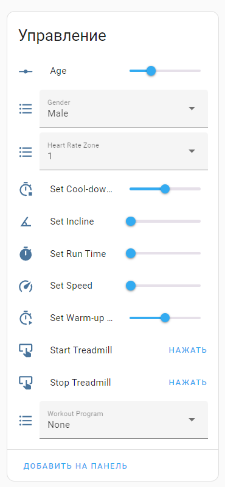
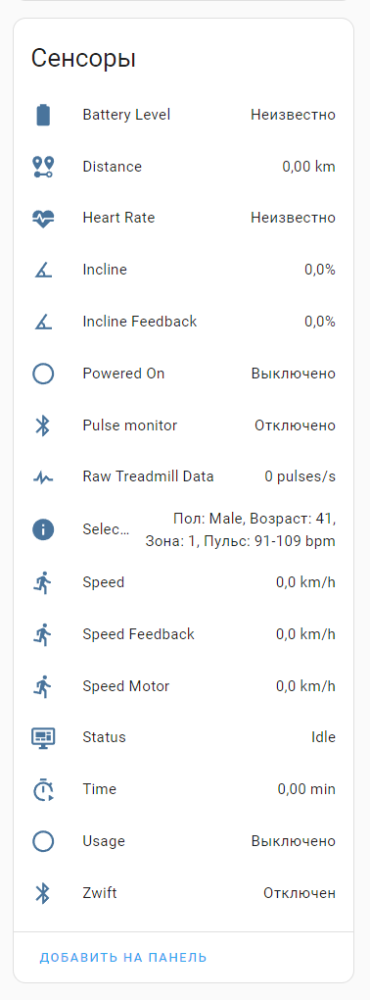

# ESPHome Беговая дорожка с Zwift и скоро с поддержкой FTMS протокола

## О проекте
Превратите свою старую беговую дорожку в умного помощника для тренировок! ESPHomeTreadmill — это бортовой компьютер на базе ESP32 S3 с прошивкой ESPHome, который добавляет поддержку Zwift, интеллектуальные программы с пульсометром и управление через UART. Проект идеально подходит для беговых дорожек с платами серии PSA(xx), но благодаря гибкости может быть адаптирован под любую дорожку с UART-интерфейсом. Минимум затрат — максимум возможностей!

## Как это работает
Проект использует ESP32 S3 для связи с платой дорожки (например, PSA(xx)) через UART. Команды вроде `[SETSPD:010]` (1 км/ч) или `[SETINC:000]` (0%) были выявлены путём анализа трафика с помощью логгера UART. Микроконтроллер обрабатывает эти данные, преобразует их в реальные значения скорости и наклона, а затем передаёт по Bluetooth Low Energy (BLE) в приложения вроде Zwift или сохраняет локально для анализа в Grafana.

Пульсометр подключается к микроконтролеру через BLE, предоставляя данные о частоте сердечных сокращений. Интеллектуальные алгоритмы в реальном времени анализируют пульс и плавно корректируют параметры дорожки, чтобы поддерживать заданную зону тренировки. Например, если пульс выходит за пределы цели, скорость автоматически подстраивается, обеспечивая персонализированный и эффективный бег.

### Преимущества
- **Гибкость**: работает с любыми дорожками, поддерживающими UART.
- **Современность**: построен на базе мощного микроконтроллера ESP32 S3.
- **Доступность**: минимум компонентов для сборки.

## Рекомендуемое оборудование
- **ESP32 S3** (настоятельно рекомендуется из-за производительности и поддержки BLE).
- **LM2596S**: преобразователь напряжения с 12 В на 5 В (неизолированный).
- **2-канальный преобразователь уровней**: для согласования 5 В (PSA(xx)) и 3.3 В (ESP32 S3).
- **Беговая дорожка**: идеально — с платой **[PSA(xx)](image/PSA(XX)H.jpg)**, но подойдёт любая с UART (RX-TX).
 H.jpg)

## Подключение
- **ESP32 S3:**
  - GPIO17 (TX) → передача данных на RX (Pin 5) PSA(xx) через преобразователь уровней
  - GPIO18 (RX) → приём данных от TX (Pin 4) PSA(xx) через преобразователь
  - GND → общая земля с преобразователем (сторона 3.3 В)
  - 3.3V → питание для стороны Low Voltage (LV) преобразователя
- **ESP32 S3:** (логический преобразователь уровней)
  - LV (Low Voltage) — сторона 3.3 В, подключена к ESP32
  - HV (High Voltage) — сторона 5 В, подключена к PSA(xx)
  - GND (LV) — земля от ESP32
  - Vcc (LV) — 3.3 В от ESP32
  - GND (HV) — земля от LM2596S
  - Vcc (HV) — 5 В от LM2596S
- **PSA(xx) Board (6 контактов):**
  - Pin 1 (12V) → питание платы, идёт на вход LM2596S и соединяется с Pin 6 (SW).
  - Pin 2 → пустой (не используется).
  - Pin 3 (GND) → общая земля с LM2596S и преобразователем.
  - Pin 4 (TX) → передача данных на GPIO18 (RX) ESP32 через преобразователь.
  - Pin 5 (RX) → приём данных от GPIO17 (TX) ESP32 через преобразователь.
  - Pin 6 (SW) → соединён с Pin 1 (12V) для включения беговой дорожки.
- **PSA(xx) Board (6 контактов):**
  - Input 12V → получает питание от Pin 1 (12V) PSA(xx).
  - Output 5V → питает сторону Vcc (HV) преобразователя.
  - GND → общая земля с PSA(xx) и преобразователем.
    
## Возможности
### Основные функции
- **Поддержка Zwift**: полная интеграция с популярной платформой.

- **Пульсометр**: подключение и расчёт зон пульса по возрасту и полу.
- **Реальные данные**: наклон в процентах и калибровка скорости.
- **Управление с кнопок**: регулировка скорости и наклона через GPIO (с обратной связью).
- **Ручной режим**: тренировка без пульсометра.
- **Локальное хранение**: сохранение пробежек и визуализация в Grafana.

### Интеллектуальная регулировка
- **Поддержание пульса**: скорость меняется плавно в зависимости от разницы с целевой зоной:
  - Разница > 20 уд/мин: ±0.5 км/ч с шагом 0.1 каждые 2 секунды.
  - Разница < 20 уд/мин: ±0.1 км/ч каждые 20 секунд.

### Разминка
- **Умный разогрев**: переводит пульс в зону 1 для подготовки связок.
- **Настраиваемое время**: ждёт достижения зоны 1, затем завершает разминку по таймеру (например, 5 минут).

### Заминка
- **Плавное снижение**: уменьшает скорость, пока пульс не вернётся в зону 1.
- **Настраиваемое время**: работает по аналогии с разминкой.

### Программы тренировок
- **Настраиваемая зона**: поддерживает заданную зону пульса через регулировку скорости.
- **Жиросжигание**: зона 2, плавная регулировка скорости и наклона.
- **Интервальная**: переключение между зонами 1 и 4 с автоматической настройкой скорости, с учетом пульса.
- **Восстановление**: удержание зоны 1 для лёгкого бега.
  
### Интерфейс в Hassio
<table>
  <tr>
    <td></td>
    <td></td>
  </tr>
</table>
  
## Настройка ESPHome
Файл (config.yaml) настраивает ESP32 S3 для управления беговой дорожкой и подключения пульсометра.
- Настройка UART для связи с беговой дорожкой (Используется для получения и отправки команд)
```yaml
uart:
  tx_pin: GPIO17    # Передача данных (TX) на GPIO17
  rx_pin: GPIO18    # Приём данных (RX) на GPIO18

# Настройка Bluetooth Low Energy (BLE) для подключения пульсометра
ble_client:
  - mac_address: "XX:XX:XX:XX:XX:XX"  # Замените на MAC-адрес вашего пульсометра
```
## Планы развития
- Поддержка стандарта FTMS для совместимости с Kinomap и iFit.
- Интерактивные карты высот и новые программы тренировок.
- Дисплей с интерфейсом для удобного управления.
- Поддержка автонаклона в Zwift.
- Разработка платы "всё в одном" для упрощения сборки.
- Написание компонента для ESPHome, чтобы упростить интеграцию проекта в экосистему.
- Датчик растояния (для регулировки скорости без кнопок)
- Добавить передачу данных по MQTT (для интеграции в любую экосистему отличную от hassio)
- Веб-интерфейс для управления без участия Home Assistant.

## Авторы
Проект создан [@samsonovss](https://t.me/samsonovss) совместно с искусственным интеллектом Grok (разработан xAI).

### **Поддержите проект**  
Если вам нравится этот проект и вы хотите помочь ему развиваться, вы можете «угостить меня кофе» с помощью криптовалютных донатов:  
- **BTC:** `bc1q3cza0kasutzes4hfddxuclmd9ghn5v7zw2nr5c`  
- **USDT (TRC-20):** `0x5dd5a346Dd64dfE938a60D7b24b633b1ACE01719`
  
Любая поддержка имеет значение — спасибо!

