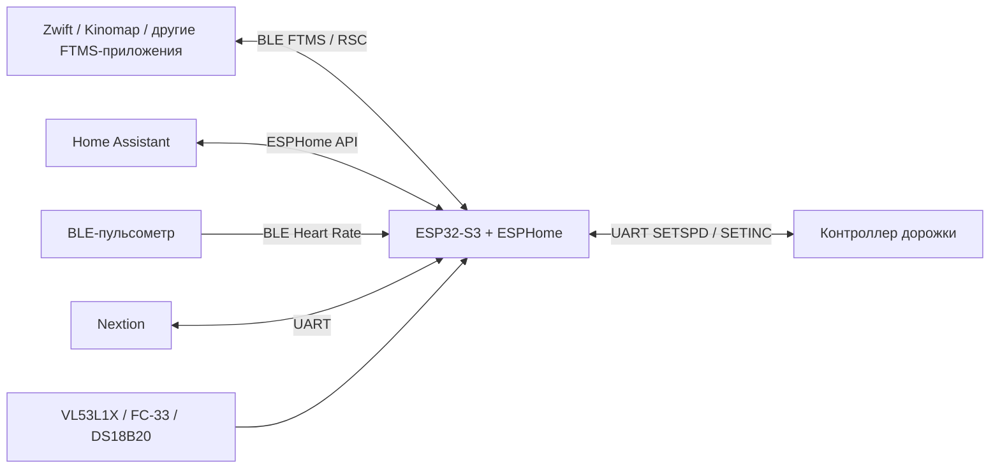

# Умная беговая дорожка на ESPHome с FTMS и нативным управлением наклоном из Zwift

[English version](README.md) | [Версии и история изменений](https://github.com/samsonovss/ESPHome-Treadmill-FTMS/releases) | [Telegram-сообщество](https://t.me/TreadmillSmart)

Полная замена штатного бортового компьютера беговой дорожки на базе ESP32-S3 и ESPHome. Проект управляет нижней платой дорожки по UART, передаёт данные в фитнес-приложения по Bluetooth FTMS, поддерживает Home Assistant, дисплей Nextion, пульсовые программы, датчики безопасности и автоматический наклон.

<p align="center">
  
</p>

## Возможности

- прямое подключение к Zwift и другим приложениям по Bluetooth FTMS;
- нативное получение градиента трассы Zwift и управление наклоном дорожки;
- калибровка соответствия реального градиента Zwift уровням конкретной дорожки;
- автономные профили высоты реальных и Zwift-маршрутов;
- управление скоростью и наклоном через Home Assistant и Nextion;
- ручной режим, пульсовые программы, разминка, заминка и HIIT;
- BLE-пульсометр с расчётом зон пульса;
- адаптивная коррекция скорости по оптическому датчику FC-33;
- управление скоростью и безопасной зоной по датчику расстояния VL53L1X;
- контроль температуры двигателя и блокировка повторного запуска после перегрева;
- статистика тренировки: время, дистанция, калории, темп, MET, VO2, жир и зоны пульса;
- дополнительная запись тренировок Home Assistant в CSV, JSON и Garmin FIT;
- корпус и крепления для 3D-печати.

## Как это работает


```mermaid
flowchart LR
    Apps[Zwift / Kinomap / другие FTMS-приложения]
    HA[Home Assistant]
    HR[BLE-пульсометр]
    ESP[ESP32-S3 + ESPHome]
    Display[Nextion]
    Sensors[VL53L1X / FC-33 / DS18B20]
    Board[Контроллер дорожки]

    Apps <-->|BLE FTMS / RSC| ESP
    HA <-->|ESPHome API| ESP
    HR -->|BLE Heart Rate| ESP
    Display <-->|UART| ESP
    Sensors --> ESP
    ESP <-->|UART SETSPD / SETINC| Board
```

ESP32-S3 становится центральным контроллером. Он принимает команды из интерфейса, программ тренировки или фитнес-приложения, отправляет их нижней плате дорожки и публикует телеметрию обратно в Home Assistant и BLE.

## Поддерживаемые приложения

Проверялись:

- Zwift;
- Kinomap на Android и iOS;
- FitShow;
- Kinni;
- Qdomyos-Zwift.

Поведение других FTMS-приложений может отличаться. Поддержка стандартного FTMS не гарантирует, что каждое приложение использует одинаковый набор характеристик и команд.

## Zwift и автоматический наклон

Проект поддерживает два независимых варианта:

1. **Нативный наклон Zwift**: текущий градиент трассы поступает непосредственно из Zwift, после чего ESPHome преобразует его в уровень наклона дорожки.
2. **Автономные профили маршрутов**: сохранённые профили высоты можно запускать без приложения Zwift.

Для нативного режима доступны:

- `Zwift Auto Incline` — разрешение физического управления наклоном;
- `Treadmill Maximum Incline Level` — максимальный уровень контроллера дорожки;
- `Treadmill Real Grade At Maximum` — измеренный реальный уклон на максимальном уровне;
- `Zwift Incline Intensity` — сила эффекта от 0 до 100%;
- `Zwift Requested Incline` — градиент, полученный от Zwift;
- `Zwift Mapped Treadmill Incline` — рассчитанная цель для дорожки.

Значение `15` на дорожке не обязательно означает реальный уклон `15%`. Перед использованием автонаклона измерьте фактический подъём полотна и выполните калибровку.

Подробная инструкция: [настройка Zwift и калибровка наклона](docs/guides/ZWIFT.ru.md).

<details>
  <summary><b>Демонстрация Zwift</b></summary>
  <p align="center">
    
  </p>
</details>

## Совместимость дорожки

Текущая конфигурация разработана для дорожки с нижней платой семейства PSA(xx), которая принимает команды:

```text
[SETSPD:010]  -> скорость 1,0 км/ч
[SETINC:050]  -> уровень наклона 5,0
```

Другую дорожку можно адаптировать, если доступен её интерфейс управления, но наличие UART само по себе не означает готовую совместимость. Необходимо определить напряжение, скорость порта, формат пакетов, команды, обратную связь и безопасные пределы.

Руководство по исследованию протокола: [UART parsing](docs/guides/UART_PARSING.ru.md).

## Оборудование

Основные компоненты:

- ESP32-S3 с PSRAM и 16 МБ Flash;
- беговая дорожка с доступом к управляющему интерфейсу нижней платы;
- двунаправленный преобразователь логических уровней;
- понижающий преобразователь питания;
- дисплей Nextion `NX4880E043-011C`, 4,3", 800 x 480;
- BLE-пульсометр.

Дополнительные компоненты:

- VL53L1X/TOF400C для Free Run, безопасной зоны и управления дисплеем;
- FC-33 для измерения и коррекции фактической скорости;
- DS18B20 для контроля температуры двигателя;
- 3D-печатный корпус и крепления.

<details>
  <summary><b>Фотографии компонентов</b></summary>
  <p align="center">
    
    
    
  </p>
  <p align="center">
    
    
    
  </p>
</details>

## Подключение

<p align="center">
  
</p>

Пины в текущей конфигурации:

| Назначение | ESP32-S3 |
|---|---|
| Nextion RX/TX | GPIO1 / GPIO2 |
| Плата дорожки TX/RX | GPIO17 / GPIO18 |
| I2C SDA/SCL | GPIO12 / GPIO11 |

Перед подключением проверьте уровни напряжения своей платы. Нельзя напрямую подавать 5 В или 12 В на GPIO ESP32-S3.

## Быстрый старт

1. Скачайте репозиторий и скопируйте содержимое каталога `esphome/` в каталог конфигурации ESPHome.
2. Переименуйте `secrets.example.yaml` в `secrets.yaml`.
3. Заполните Wi-Fi, API, OTA, резервную точку доступа, адрес DS18B20, MAC-адрес пульсометра и URL TFT-файла Nextion.
4. Сохраните каталог `packages/` рядом с `config.yaml`: главный файл загружает из него все функциональные разделы.
5. Проверьте распиновку, UART-параметры и команды своей дорожки.
6. Отключите силовую часть и сначала проверьте загрузку ESP32, Nextion и датчики.
7. Создайте резервную копию, скомпилируйте конфигурацию и изучите логи.
8. Проверьте остановку, минимальную скорость и возврат наклона без человека на полотне.

Конфигурация является рабочим примером конкретной установки, а не универсальной прошивкой для любой дорожки.

## Режимы тренировки

- ручное управление;
- Pulse Zone;
- Fat Burn;
- Recovery Run;
- HIIT с настраиваемыми циклами работы и восстановления;
- разминка и заминка;
- Free Run по положению пользователя;
- маршруты с заранее рассчитанным профилем высоты;
- нативное управление наклоном из Zwift.

Доступны профили коррекции скорости `Soft`, `Precise` и `Aggressive`, а также профили разгона `Soft`, `Normal`, `Fast` и `Technogym`.

## Интерфейсы

Локальный веб-интерфейс ESPHome доступен на порту `80` без авторизации. Web OTA через него не включён. Используйте его только в доверенной локальной сети и не публикуйте в интернет.

Запись тренировок в CSV и Garmin FIT доступна через дополнительный [рекордер для Home Assistant](treadmill_workouts/README.ru.md).

<details>
  <summary><b>Home Assistant</b></summary>
  <p align="center">
    
  </p>
</details>

<details>
  <summary><b>Nextion</b></summary>
  <p align="center">
    
  </p>
</details>

<details>
  <summary><b>Фотографии готовой дорожки</b></summary>
  <p align="center">
    
    
    
  </p>
  <p align="center">
    
    
    
  </p>
</details>

Видео:

- [обзор панели управления](https://youtube.com/shorts/wjRsA46usog);
- [дорожка во время бега](https://youtube.com/shorts/QqvJLKn4GOk).

## Структура репозитория

- [`esphome/config.yaml`](esphome/config.yaml) — короткий основной файл, загружающий локальные пакеты;
- [`esphome/packages/`](esphome/packages/) — ядро, оборудование, глобальные переменные, скрипты, сенсоры, BLE/FTMS, элементы управления и Nextion;
- [`esphome/incline_profiles.h`](esphome/incline_profiles.h) — сгенерированные профили наклона маршрутов;
- [`treadmill_workouts/`](treadmill_workouts/) — запись тренировок Home Assistant в CSV и экспорт в FIT;
- [`nextion_display/`](nextion_display/) — исходник, HMI и готовый TFT дисплея;
- [`incline_data/`](incline_data/) — GPX, профили маршрутов и скрипты преобразования;
- [`3d-models/`](3d-models/) — корпус и крепления для печати;
- [`PCB/`](PCB/) — материалы будущей печатной платы;
- [`docs/guides/`](docs/guides/) — подробные инструкции;
- [`docs/specs/FTMS_v1.0.pdf`](docs/specs/FTMS_v1.0.pdf) — спецификация FTMS;
- [GitHub Releases](https://github.com/samsonovss/ESPHome-Treadmill-FTMS/releases) — версии и история изменений.

## Планы

- измерение каденса.

Уже реализованные функции удаляются из планов и фиксируются в [описаниях версий](https://github.com/samsonovss/ESPHome-Treadmill-FTMS/releases).

## Автор и сообщество

Проект создан [Антоном Самсоновым](https://t.me/samsonovss).

Обсуждение, сборки и помощь: [Treadmill Smart](https://t.me/TreadmillSmart).

## Поддержка проекта

- PayPal: `samsonov@hotmail.com`
- BTC: `bc1q3cza0kasutzes4hfddxuclmd9ghn5v7zw2nr5c`
